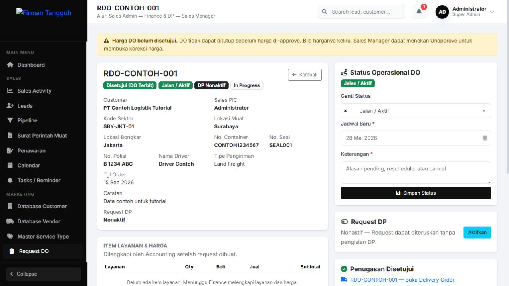
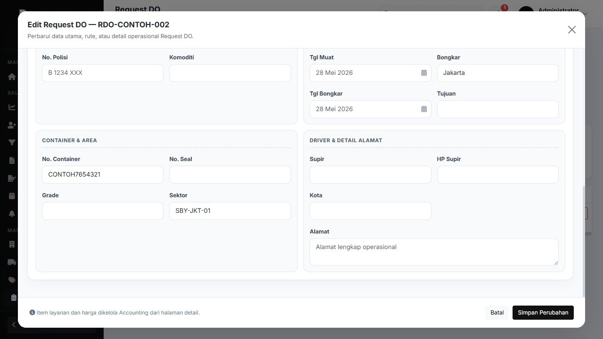
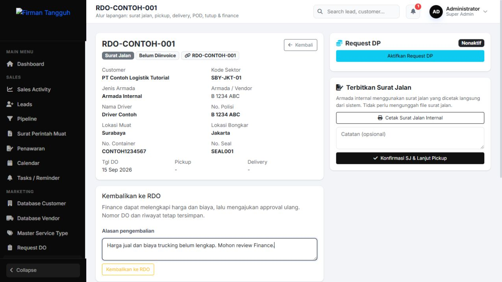
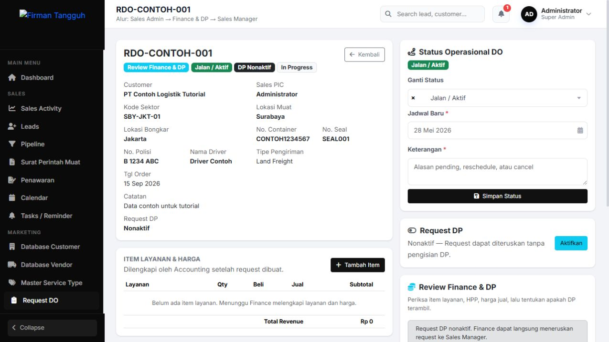
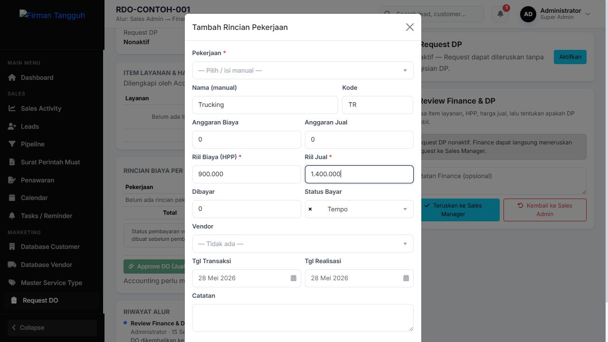
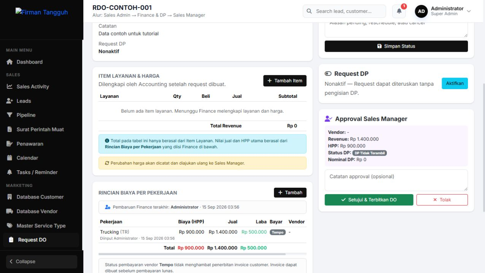
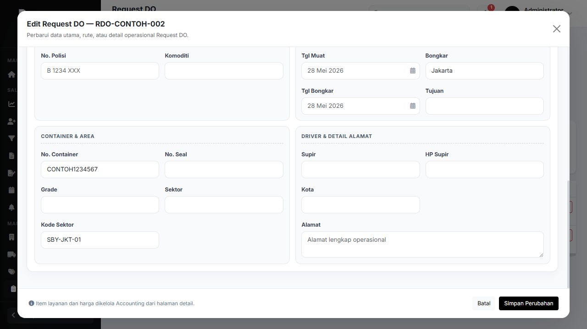

# Panduan revisi RDO dan DO

Panduan berdasarkan aplikasi lokal hasil revisi 15 September 2026. Semua order, perusahaan, kode, dan angka pada screenshot adalah data contoh.

## Panduan revisi RDO dan DO

Kode sektor pada detail order

Tujuan: menggunakan kode sektor, mengembalikan DO untuk koreksi harga dan biaya, serta memeriksa kemungkinan RDO duplikat. Buka Request DO, lalu klik ikon Detail &amp; Flow pada order. Kode sektor tampil di informasi utama dan juga di detail Delivery Order.

Screenshot aplikasi lokal menggunakan data contoh. Panduan ini berlaku setelah revisi dipasang pada aplikasi yang digunakan.

## Mengisi atau memperbarui kode sektor

Petugas yang memiliki akses membuat atau mengedit RDO

1. Buka Request DO, pilih Tambah Request DO atau ikon pensil pada RDO yang masih dapat diedit. 2. Buka Detail Operasional Muatan, lalu bagian Container &amp; Area. 3. Isi Kode Sektor sesuai kode yang digunakan perusahaan, kemudian simpan. Contoh di gambar: SBY-JKT-01.

Kode sektor membantu Finance menentukan harga dan biaya; nilainya tidak mengisi harga secara otomatis. Jika kode kosong, detail memakai nilai Sektor jika tersedia.

## Mengembalikan DO ke RDO

Dilakukan oleh Admin atau Sales Manager termasuk Super Admin

1. Buka Delivery Orders, lalu detail DO yang akan diperbaiki. 2. Pada panel Kembalikan ke RDO, tulis alasan pengembalian. 3. Klik Kembalikan ke RDO dan pilih OK pada konfirmasi. Ulangi per DO jika ada beberapa order.

Syarat: masih tahap Surat Jalan, belum ditagihkan atau masuk item invoice, serta belum memiliki POD atau penutupan DO. Nomor dan riwayat tetap tersimpan.

## Memeriksa RDO yang dikembalikan

Finance melanjutkan perbaikan dari halaman detail RDO

1. Setelah pengembalian, aplikasi membuka detail RDO dengan tahap Review Finance &amp; DP. 2. RDO muncul kembali pada daftar Request Aktif; DO sementara keluar dari daftar Delivery Orders. 3. Periksa alasan pada Riwayat Alur, kode sektor, customer, dan rute sebelum memperbaiki harga.

Approval harga sebelumnya dibatalkan. Pengembalian bukan penghapusan permanen; DO yang sama akan digunakan lagi saat disetujui ulang.

## Melengkapi harga dan biaya

Dilakukan oleh Finance atau Admin termasuk Super Admin

1. Pada Rincian Biaya per Pekerjaan, klik Tambah atau ikon pensil untuk rincian yang sudah ada. 2. Pilih pekerjaan atau isi nama manual; periksa Riil Biaya (HPP), Riil Jual, vendor, dan status bayar. 3. Klik Simpan di bagian bawah form. Contoh angka pada gambar bukan tarif acuan.

Lengkapi juga Item Layanan & Harga bila diperlukan. Setelah data benar, selesaikan Review Finance & DP dan klik Teruskan ke Sales Manager. Jika DP aktif, lengkapi status dan nominal DP.

## Menyetujui ulang dan menerbitkan DO

Sales Manager atau Admin memeriksa hasil koreksi

1. Buka RDO dengan tahap Menunggu Approval, lalu periksa nilai jual, HPP, rincian pekerjaan, dan DP. 2. Setujui harga melalui Approve DO setelah nilainya benar. 3. Pada Approval Sales Manager, klik Setujui &amp; Terbitkan DO dan konfirmasi. Jika belum benar, gunakan Tolak disertai catatan.

DO kembali tampil dengan nomor dan riwayat yang sama, tanpa membuat DO kedua. Approval harga dan penerbitan DO adalah dua tindakan; harga harus disetujui sebelum DO dapat ditutup.

## Menangani peringatan RDO duplikat

Berlaku saat membuat maupun menyimpan perubahan RDO

1. Klik tombol simpan seperti biasa. Jika data cocok dengan order lain, aplikasi meminta konfirmasi. 2. Pilih Cancel / Batal untuk memeriksa dan memperbaiki data; isian form tetap tersedia. 3. Pilih OK hanya jika sudah dipastikan merupakan order terpisah yang sah.

Screenshot menunjukkan form setelah peringatan dibatalkan. Teks dialog dan aturan pencocokan dijelaskan pada halaman berikutnya.

## Aturan duplikat dan kendala umum

### Teks konfirmasi yang muncul

Kemungkinan RDO duplikat: RDO-CONTOH-001. Periksa data dan konfirmasi sebelum menyimpan.
Tetap simpan sebagai order terpisah?

Tombol: Cancel dan OK. Nama tombol mengikuti bahasa browser. Teks ini disalin dari dialog yang muncul saat pengujian; bukan gambar dialog.

### Kapan data dianggap berpotensi duplikat

Customer dan tanggal order sama, lalu salah satu nomor container, seal, atau tracking sama; atau kombinasi nomor polisi, lokasi muat, dan lokasi bongkar sama. Huruf besar/kecil dan spasi diabaikan. Order yang dibatalkan atau dihapus tidak ikut diperiksa. Saat mengedit, order itu sendiri tidak dihitung sebagai duplikat.

### Tombol Kembalikan ke RDO tidak muncul

Periksa peran akun, tahap Surat Jalan, dan status penagihan. DO yang sudah pickup atau lebih lanjut tidak memakai jalur pengembalian ini. Untuk koreksi harga pada DO yang masih belum ditagihkan, minta pengelola memeriksa jalur Unapprove di detail RDO sesuai kewenangan.

### Harga masih belum bisa diedit atau RDO tidak ditemukan

Pastikan RDO sudah berada di tahap Review Finance &amp; DP dan akun memiliki akses Finance/Admin. Pada daftar Request DO, periksa rentang tanggal dan filter Request Aktif. Komponen yang sudah masuk invoice tidak dapat dikoreksi melalui alur ini.

### Simpan gagal atau koneksi terputus

Baca pesan kesalahan dan periksa daftar order sebelum mencoba ulang. Jangan membuat order baru hanya karena halaman belum berpindah. Sistem memakai pengunci kirim ganda untuk menghindari pemrosesan ulang aksi yang sama.
